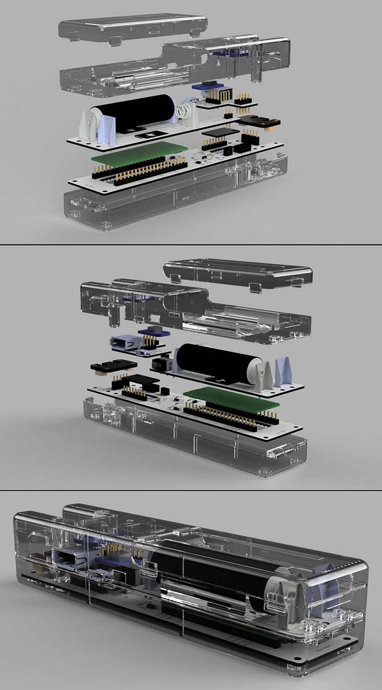
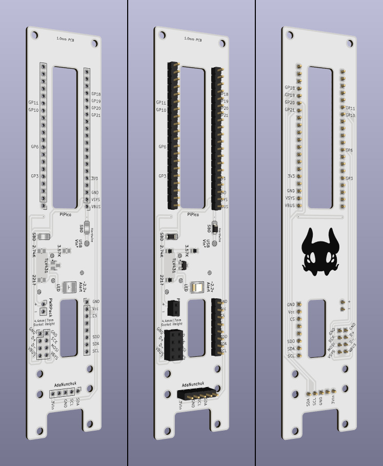
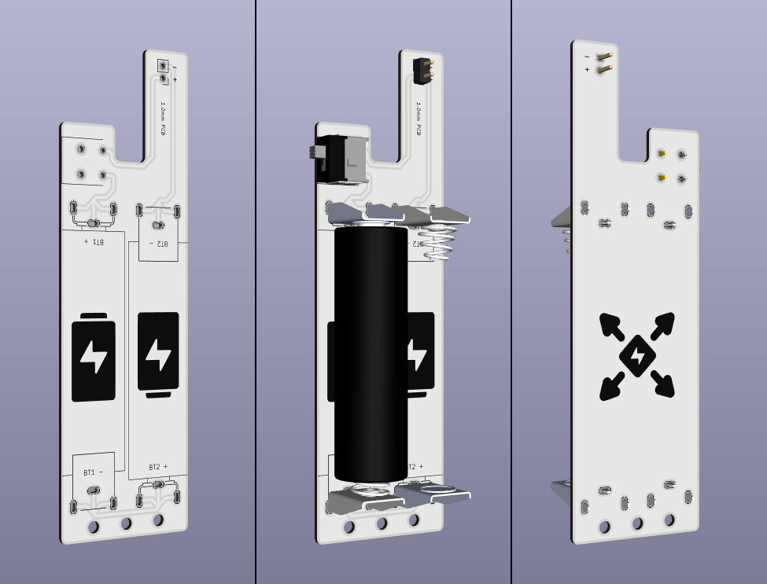
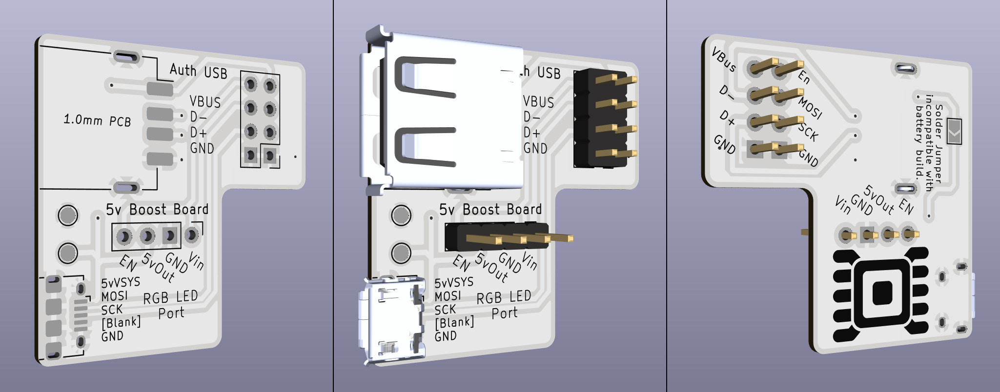
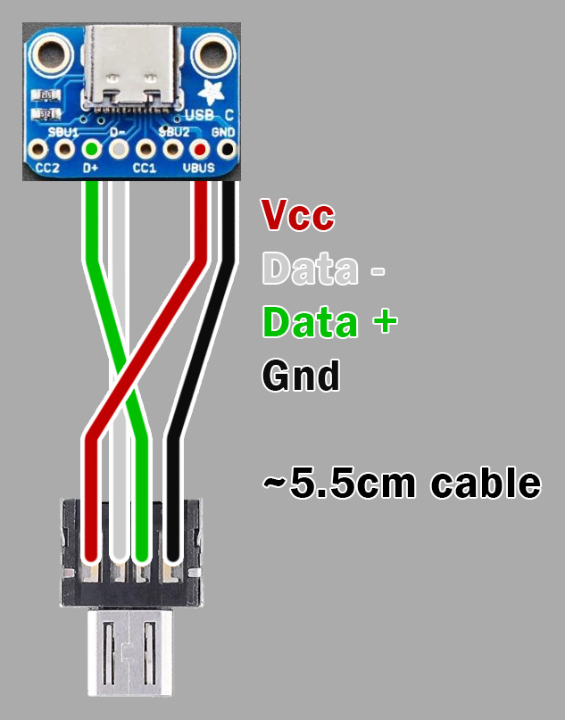
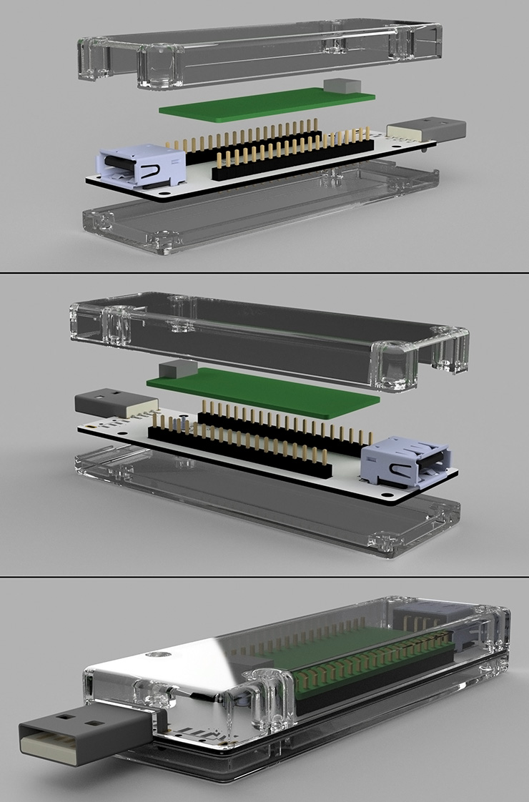
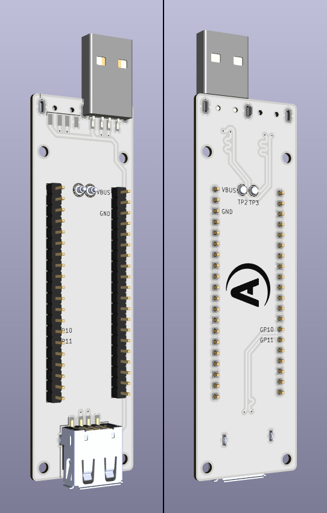
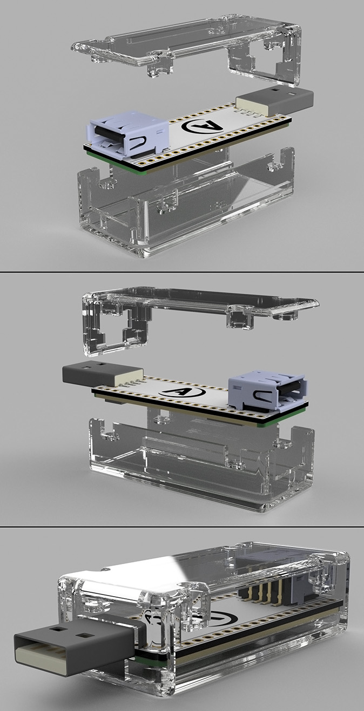
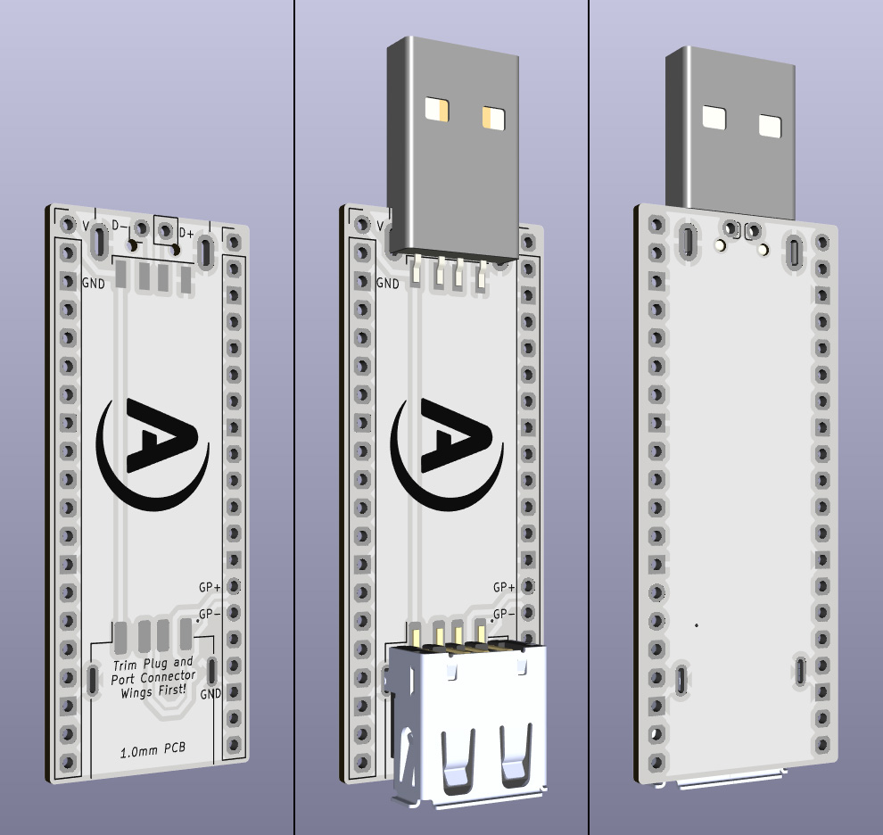

# Andale Adapter

The Andale Adapter Project is a Wii Remote–sized adapter for Wii Guitar Hero Controllers, powered by a Raspberry Pi Pico/Pico W running Santroller firmware.
This project, through the Santroller firmware, enables these controllers to function on PC/Xbox/PlayStation platforms through USB connectivity, or though Bluetooth via custom recievers also powered by a Raspberry Pi Pico W running Santroller firmware.
The circuit boards have been designed with hand assembly in mind, and requires the soldering of both through-hole components and surface mount devices (SMD). The use of SMD components makes a soldering plate recommended equipment, but sufficient pad clearence has been used to enable careful hand soldering.

---

## Repository Structure

This repository contains three main sections:

1. **Andale Adapter** - the Adapter itself, the "brains" of the project.
2. **Slim Receiver** - a compact Bluetooth receiver, designed for low height.
3. **Tiny Receiver** - a minimal volume Bluetooth receiver, designed for portability.

All three sections include:
- KiCAD project files and Gerber outputs.
- STL files for 3D printed enclosures.
- Autodesk Fusion project files for the STLs.
- Bills of Material (BOM) files in CSV format.

> **Note:** All enclosure STLs are designed for resin printing. Extensive use of overhangs makes them less ideal for FDM printing.

---

## Overview

The Andale Adapter is designed with certain optional elements. Depending on the desired configuration, builders can choose to integrate multiple additional features:

 Feature | Description |
----------|--------------|
 Bluetooth and/or USB connectivity | Supports both wireless and wired operation. |
 RGB LED support | Allows support for up to 10 RGB LEDs on customised PCBs though a USB Micro port. |
 Controller authentication support | Required for consoles that need controller verification, done so over a regular USB port. |
 AA battery power | Recommended for Bluetooth operation. Designed around NiMH rechargable batteries. |

> **Note:** For a Bluetooth setup USB Auth is not required on the adapter. It's only required for wired configuration on console systems that require it.

---

## Assembly Order

Due to the mixed component types and modular structure, the following rough build order is recommended:

1. Prepare customised components (e.g., modified headers, trimmed USB connectors).
2. Solder Surface Mount Devices (SMDs).
3. Solder USB connectors (if applicable).
4. Solder through-hole components (e.g., headers, battery terminals).
5. Solder add-in boards (Pico, Nunchuck adapter, accelerometer).
6. Final assembly into enclosures.

---

## Andale Adapter

The Andale Adapter is the primary focus of the project, and contains the most complex components.
A small internal cable can be made to route the Pico USB Micro to a USB-C breakout board, and a sample wiring diagram is included.
Due to height & space limitations, the PCBs in the adapter are 1mm thick by design.

### Adapter Components

| Component | Purpose |
|------------|----------|
| Mainboard | Core PCB carrying the Pico, accelerometer, and Nunchuck adapter. |
| Battery Board | Optional PCB for AA NiMH battery power and On/Off switch. |
| Connector Board | Optional PCB for controller authentication, RGB integration (with voltage boost). |
| Internal Cable | Adapting and routing the Pico USB Micro Port to a USB-C Port on the top of the case |

### Build Notes
- For Bluetooth setups, a Raspberry Pi Pico W is a requirement.
- For USB setups, either Pico or Pico W may be used.
- A USB cable or the USB-C breakout may be hardwired to the mainboard if preferred over using an internal USB Micro cable.

---

### Bill of Materials - Mainboard

| Part | Component Type | Part Code | Qty | Purpose | Notes |
|------|----------------|------------|------|----------|-------|
| Pi Pico W | Commercial Product | - | 1 | Controller logic | Use Pico for wired-only builds. |
| 1x10 Low Profile Male Header | Through-hole | - | 2 | Mount for Pico W | - |
| 1x05 Male Header | Through-hole | - | 1 | Mount for Nunchuck Adapter | Requires double insulator height. |
| Adafruit Nunchuck Adapter | Commercial Product | - | 1 | Nunchuck connector integration | - |
| 1x08 Low Profile Male Header | Through-hole | - | 1 | Mount for ADXL345 | - |
| Triple Axis SEN0032 ADXL345 Board | Commercial Product | - | 1 | Accelerometer | Other ADXL345 board compatibility is uncertain. |
| 1x02 Low Profile Female Header | Through-hole | - | 1 | Powerboard plug | - |
| 1x04 Low Profile Female Header | Through-hole | - | 2 | Connector board plug | Insulator height 4 or 7 mm. |
| 20V 1A Schottky Diode | SMD (SOT-123F) | MBR120VLSFT1G | 1 | Power direction regulator | Required for battery or hardwired power. |
| LED | SMD (1208) | QBLP653-S5 | 1 | Low-voltage indicator | - |
| 1.25 V Voltage Shunt | SMD (DBZ) | TLV431DBZ | 1 | Voltage detection | Must use TL**V**431 variant. |
| 3.57 kΩ Resistor | SMD (0805) | RQ73C2A3K57BTD | 1 | Voltage divider | - |
| 2.74 kΩ Resistor | SMD (0805) | RQ73C2A2K74BTD | 1 | Voltage divider | - |
| 221 Ω Resistor | SMD (0805) | RQ73C2A221RBTD | 1 | LED current limiter | Value not optimal but functional. |
| USB Male to Micro Adapter | Commercial Product | - | 1 | Internal cable | Optional; unnecessary for a directly hardwired setup. |
| Adafruit USB-C Downstream Breakout | Commercial Product | - | 1 | External connector | - |
| Silicone Ribbon Cable (4× 28 AWG) | Commercial Product | - | 1 | Internal wiring | - |

---

### Bill of Materials - Battery Board

| Part | Component Type | Part Code | Qty | Purpose | Notes |
|------|----------------|------------|------|----------|-------|
| 1x2 Male Header | Through-hole | - | 1 | Plug to mainboard | Mount upside down if using 7 mm tall header sockets. |
| On-Off Switch | Through-hole | AS11AH | 1 | Power control | - |
| AA Battery Terminal, Plate | Through-hole | Keystone 595 | 2 | Battery contact | - |
| AA Battery Terminal, Coil | Through-hole | Keystone 628 | 2 | Battery contact | - |

---

### Bill of Materials - Connector Board

| Part | Component Type | Part Code | Qty | Purpose | Notes |
|------|----------------|------------|------|----------|-------|
| 1x04 Male Header | Through-hole | - | 2 | Plug to mainboard | Mount upside down if using 7 mm tall header sockets. |
| 1x04 Low Profile Male Header | Through-hole | - | 1 | Mount for TinyBoost | - |
| USB Micro Female | Through-hole | Amphenol 10118194-0001LF | 1 | RGB integration | Nonstandard use of USB port. |
| USB A Female | Through-hole | GCT USB1046 | 1 | Controller auth | Required for wired console use. |
| Adafruit MiniBoost 5V | Commercial Product | - | 1 | Voltage boost for RGB | Skip for non-battery builds. |

---

## Slim Receiver

The Slim Receiver is a Bluetooth receiver designed for consoles or PCs.
It uses a Pico W, connects directly via USB-A, and includes a secondary port for controller auth.

### Key Characteristics
- Compact vertical height.
- Left- or right-offset USB configuration so two recievers can be used side-by-side

### Bill of Materials - Slim Receiver

| Part | Component Type | Part Code | Qty | Purpose | Notes |
|------|----------------|------------|------|----------|-------|
| Pi Pico W | Commercial Product | - | 1 | Logic | Required. |
| 1x10 Low Profile Male Header | Through-hole | - | 2 | Mount for Pico W | - |
| USB A Male | Through-hole | CNCTech 1001-011-01101 | 1 | Plug for console/PC | Offset configuration possible. |
| USB A Female | Through-hole | GCT USB1046 | 1 | Auth plug | Required for consoles needing authentication. |
| 3.18 mm → 1.78 mm Pogo Pin | Through-hole | 0926-1-15-20-75-14-11-0 | 2 | Pico testpoint connection | 2.54 mm target height. |

---

## Tiny Receiver

The Tiny Receiver alternatively offers a minimal design for ease of transport. It does however have a larger vertical height and worse horizontal clearance, so fitting multiple in side-by-side USB ports may be impossible.
It mounts the Pico W directly underneath the PCB, requiring precise soldering and a fine-tipped soldering iron.

### Build Notes
- Mount the Pico W on the underside and solder through the seven marked pads.
- Trim USB plug and port wings to fit enclosure.
- Difficult to build & repair. Not recommended.

### Bill of Materials - Tiny Receiver

| Part | Component Type | Part Code | Qty | Purpose | Notes |
|------|----------------|------------|------|----------|-------|
| Pi Pico W | Commercial Product | - | 1 | Logic | Mounted underside. |
| USB A Male | Through-hole | CNCTech 1001-011-01101 | 1 | Main plug | Trim wings to < 1 mm. |
| USB A Female | Through-hole | GCT USB1046 | 1 | Auth port | Trim wings to < 1 mm. |

---

## Hardware Fasteners

A bulk pack of metric M2 machine screws is recommended.

| Section | Part | Component Type | Qty | Purpose |
|----------|------|----------------|------|----------|-------|
| Adapter Shell | M2 Machine Screw 4 mm | Commercial Product | 3 | Mounts mainboard, power board |
| Adapter Shell | M2 Machine Screw 6 mm | Commercial Product | 4 | Mounts breakout, shell rear |
| Adapter Shell | M2 Machine Screw 8 mm | Commercial Product | 2 | Mounts shell front |
| Slim Shell | M2 Machine Screw 6 mm | Commercial Product | 4 | Holds halves together |
| Tiny Shell | M2 Machine Screw 6 mm | Commercial Product | 4 | Holds halves together |

---

## Firmware

This project uses Santroller firmware by Sanjay900.
All credit for firmware functionality belongs to the original author.

For more information visit the Santroller website.

---

## Thanks

Thank you to Sanjay & the Santroller community. They were openly welcoming and provided a great deal of support and validation during the development of this project. It would not have been possible without them.

---

## Licensing

All designs, documents, and files in this repository are released under the **Creative Commons Attribution–ShareAlike (CC-BY-SA)** license.
You are free to modify, distribute, and remix, provided that proper credit is given and derivatives are shared under the same terms.
